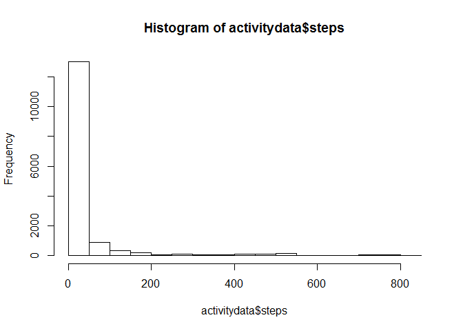
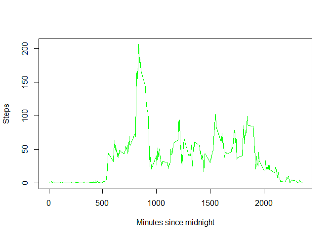
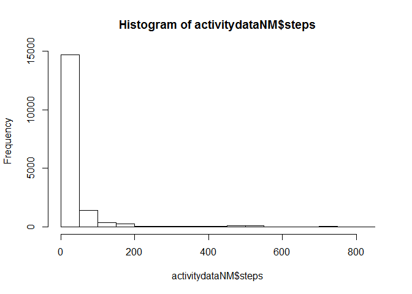
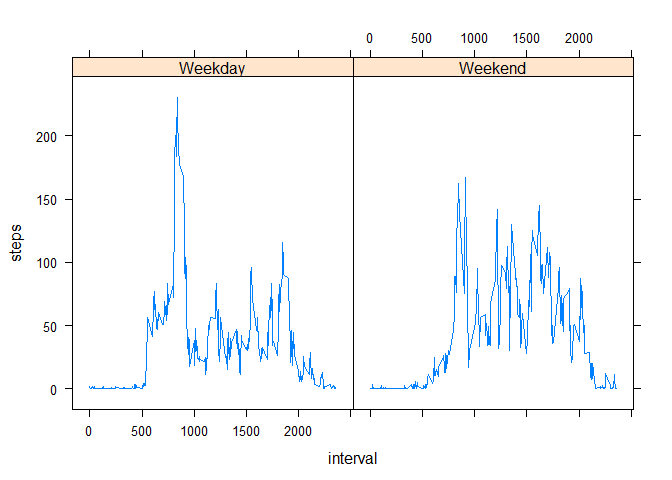

# Reproducible Research: Peer Assessment 1

echo=TRUE

## Loading and preprocessing the data
Load the data. I actually unzipped the file and just read the .csv, so we just and load it, no further preprocessing necessary. Could have read the zip directly but don't know if that was necessary.

Also, let's load the packaces we use later.

```r
activitydata <- read.csv("activity.csv")
library(plyr)
library(lattice)
```

## What is mean total number of steps taken per day?

Here's a historgram along with the mean and the median.

```r
hist(activitydata$steps)
```

 

```r
mean(activitydata$steps, na.rm=T)
```

```
## [1] 37.3826
```

```r
median(activitydata$steps, na.rm=T)
```

```
## [1] 0
```
## What is the average daily activity pattern?

Here's how the number of steps varies by day.

```r
stepmean <- aggregate(steps~interval, activitydata, mean)
plot(stepmean$interval, stepmean$steps, ylab="Steps", 
     xlab="Minutes since midnight", type="l", col="green")
```

 

And as you can see, the most steps are taken at 

```r
stepmean$interval[which.max(stepmean$steps)]
```

```
## [1] 835
```
People heading to work in the morning.

## Imputing missing values

Not surprisingly, there's a bunch of missing data. In fact, 

```r
sum(!complete.cases(activitydata)) 
```

```
## [1] 2304
```
cases have some. Let's do a simple mean imputation

```r
impute.mean <- function(x) replace(x, is.na(x), mean(x, na.rm = TRUE))
activitydataNM <- ddply(activitydata, ~ interval,
                        transform, steps = impute.mean(steps))
```

What happened to our descriptive statistics? Not much, or anything.

```r
hist(activitydataNM$steps)
```

 

```r
mean(activitydataNM$steps, na.rm=T)
```

```
## [1] 37.3826
```

```r
median(activitydataNM$steps, na.rm=T)
```

```
## [1] 0
```

## Are there differences in activity patterns between weekdays and weekends?

The weekdays() function uses the local system language, so here's my code in Finnish. It wouldn't work if your machine speaks English.


```r
activitydataNM$day <- weekdays(as.Date(activitydataNM$date), abbreviate=T)
weekday <- c("ma", "ti", "ke", "to", "pe")
activitydataNM$weekday[activitydataNM$day %in% weekday] <- "Weekday" 
activitydataNM$weekday[!activitydataNM$day %in% weekday] <- "Weekend" 
```

And then calculate differences between weekdays and weekends and plot them. I used the lattice package for this and the plot could be made more informative and prettier with this tool but here's just a default version.


```r
weekdaymean <- aggregate(steps~weekday+interval, activitydataNM, mean)
xyplot(steps~interval | weekday, data=weekdaymean, type="l")
```

 

That should be all!

